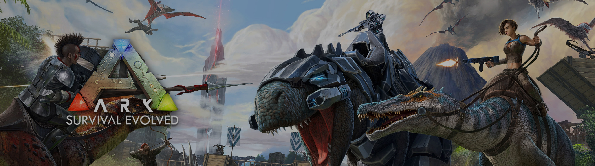

# 🎮 Online Games Store

A web-based **Online Game Store** application built using **CodeIgniter 3** and **MySQL**, developed as a collaborative project.

## 📌 Features

- Admin & User authentication
- Game catalog browsing
- Add to cart functionality
- Order and transaction management (Admin)
- User purchase history
- Responsive design

## 🛠️ Tech Stack

- **Backend**: PHP (CodeIgniter 3)
- **Frontend**: HTML, CSS, JavaScript
- **Database**: MySQL
- **Web Server**: Apache (XAMPP)

## 👥 Team Members

- Irsyad Al Ma'ruf  
- Defri Prasetyo  
- Birul Walid  
- Defa Anges Tunggara  
- Muhammad Iqbal Saputra

## 🔐 Login Credentials

### 👤 Admin
- **Email**: `admin@gmail.com`  
- **Password**: `admin`

### 👤 User
- **Email**: `user@gmail.com`  
- **Password**: `user`

## 📸 Screenshots

